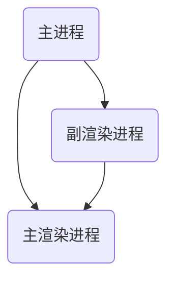

# Electron 指南

## Electron 简介

Electron 是一个使用 JavaScript、HTML 和 CSS 构建桌面应用程序的框架。 嵌入 Chromium 和 Node.js 到 二进制的 Electron 允许您保持一个 JavaScript 代码代码库并创建 在 Windows 上运行的跨平台应用 macOS 和 Linux——不需要本地开发经验。

Electron 不同于一般 Web 应用，它继承了来自 Chromium 的多进程架构，这使得此框架在架构上非常相似于一个现代的网页浏览器。

这个特性更加切合我们使用客户端的需求。有时，除了主窗口外，还需要很多副窗口。比如使用 QQ，我们可以打开多个人的聊天窗口。

## 快速开始

[Electron 官网用例](https://www.electronjs.org/zh/docs/latest/tutorial/quick-start)

[Electron 安装](https://www.electronjs.org/zh/docs/latest/tutorial/installation)

安装 Electron 包，加入生产环境

```
// npm
npm install --save-dev electron

// yarn
yarn add --dev electron
```

配置 package.json，通过`npm start`或`yarn start`运行项目。

```json
// package.json
{
  "scripts": {
    "start": "electron ."
  }
}
```

## 进程模型

初次接触 Electron，首先需要理解的就是它的进程模型。

Electron 将进程主要分为两类：主进程和渲染进程。主进程相当于一个管理员，可以创建与管理各种渲染进程，而渲染进程相当于浏览器中的各个标签页。

### 进程创建

#### 主进程

主进程在`index.js`中默认创建，并且可通过下面监听创建完毕和关闭事件。

```js
// index.js
const { app, BrowserWindow } = require("electron");

app.whenReady().then(() => {
  createWindow();
});

app.on("window-all-closed", function () {
  if (process.platform !== "darwin") app.quit();
});
```

#### 渲染进程

创建渲染进程即创建一个窗口，一般一个客户端应该包含一个主渲染进程，我们给其起名为`mainWindow`。

```js
// index.js

// create a window
function createMainWindow() {
  let mainWindow = new BrowserWindow({
    frame: false, // no border
    // resizable: false,		// no resize
    width: 800,
    height: 600,
    icon: iconPath,
    webPreferences: {
      backgroundThrottling: false, // run in back
      nodeIntegration: true, // use nodeApi
      contextIsolation: false, // relate to preload
      // preload: preLoadPath
    },
  });

  // load the html
  mainWindow.loadFile(indexPath);
  mainWindow.removeMenu();
}
```

该函数只需在`app.whenReady`中调用即可创建一个主窗口。

在创建`BrowserWindow`中可以定义窗口具备的多个属性，如`frame`定义是否具备边框；`resizable`定义是否可以拉伸窗口；`backgroundThrottling`定义是否能够在后台运行。其中值得着重说明的属性是`contextIsolation`定义上下文隔离，我将会在下面提到这个问题。

> 注意，根据一些其它的入门教程，在这里使用`mainWindow.loalUrl(file://绝对路径)`来加载本地页面文件，以现在的版本来说这种加载方法是失效的，除非额外配置对 file 协议的处理。而现在的版本中只需要使用`loadFile`即可加载本地文件。

### 进程通信

进程间通信英文 Inter-Process Communication，在主进程中通过`ipcMain`来调用与其相关的函数。

以下将展示下面三种通信类型。



#### 渲染进程 to 主进程

`ipcMain`是仅存在于主进程中的一个对象，只能在主进程中调用，其上可以挂载多个监听器，面向所有渲染进程来监听事件。正是因此，一个好的习惯是在事件名称的命名为“渲染进程名+事件名”。如以下的`mainWindow:close`表示监听主渲染进程的关闭事件。

主进程通过`ipcMain.on`来监听事件，渲染进程通过`ipcRenderer.send('eventName')`来触发事件。

```js
// index.js
ipcMain.on("mainWindow:close", () => {
  mainWindow.hide();
});

// render.js
ipcRenderer.send("mainWindow:close");
```

主进程监听的事件同时可以获取渲染进程传递的参数，如下`(event,task)=>{}`

> 注意，第一个参数一定是 event，第二个参数之后才是真正传播的数据。

```js
ipcMain.on("mainWindow:setTaskTimer", (event, task) => {
  // ...
});
```

与一般的事件监听不同，electron 的事件监听具备同步或异步获取函数返回值的特点。

其中通过`event.returnValue`来处理同步通信，通过`event.reply('eventName')`来处理异步通信。但是同步通信会阻塞主进程，官方文档中更建议使用异步。

以下为截取的一部分官网给出的例子。

```js
// index.js
ipcMain.on("asynchronous-message", (event, arg) => {
  console.log(arg); // prints "ping"
  event.reply("asynchronous-reply", "pong");
});

ipcMain.on("synchronous-message", (event, arg) => {
  console.log(arg); // prints "ping"
  event.returnValue = "pong";
});

// renderer.js
console.log(ipcRenderer.sendSync("synchronous-message", "ping")); // prints "pong"

ipcRenderer.on("asynchronous-reply", (event, arg) => {
  console.log(arg); // prints "pong"
});
ipcRenderer.send("asynchronous-message", "ping");
```

#### 主进程 to 渲染进程

主进程主动给渲染进程发送消息是通过渲染进程的`webContents`来完成。这里的理解要准确，所说的渲染进程指的是在`index.js`中创建的渲染进程对象，并不指的是渲染进程的页面中的对象。

此处需要`webContents.on("did-finish-load")`极有必要，因为只有在渲染进程的页面加载完毕后，`webContents.send`才能够触发其事件（已测试过`send`执行时间早于渲染页面加载 JS 脚本的时间）

```js
viceWindow.webContents.on("did-finish-load", () => {
  viceWindow.webContents.send("event", task);
});
```

> 注意，`webContents`中的监听事件无法像`ipcMain`一样自定义，对于渲染进程触发的事件，官方文档中给出了明确的列表。“did-finish-load”事件在渲染进程导航加载完成时触发。

#### 渲染进程 to 渲染进程

渲染进程与渲染进程间的通信是通过`ipcRenderer.sendTo`来完成。

下面例子中的`windowId`代表目标渲染进程的 ID，根据个人测试 Electron 的进程 ID 会从 1 开始按顺序递增，主渲染进程为第一个创建的进程，一般其 ID 为 1。但是，如果想确定获取某个进程的 ID，只能够在主进程中通过`mainWindow.webContents.id`获取，并发送给该渲染进程。

```js
// ipcRenderer.sendTo(windowId, "finishEvent", params);
ipcRenderer.sendTo(1, "finishEvent", params);
```

这里需要说明的是，如果存在多个窗口，需要处理好各个窗口关系，并存储各个窗口的 ID，方便数据传输。

## 预加载

如果到这里，你还记得前面提到的`contextIsolation`，那我将很感谢你在认真阅读。

### 逻辑结构

如果使用 Electron 不愿意复杂化，那么按照我们的文件目录大概如下：

```
- project
    - index.js
    - src
        - index.html
        - render.js
        - style.js
```

如果按照我上面所说进行配置，大概不会碰到什么棘手的问题。

但是按照官方给出的 quick-start 的例子，其文件目录中还包含一个`preload.js`脚本，文件目录成为下面这样，这就是预加载，这是因为官放例子中`contextIsolation`属性设置为`true`（默认为`true`）

```
- project
    - index.js
    - preload.js
    - src
        - index.html
        - render.js
        - style.js
```

### 上下文隔离

于是，引出 Electron 的又一个关键的概念，**上下文隔离**。

在一般的我们的前端项目中，渲染 html 页面的 js 中是运行在浏览器环境中的，而在 Electron 中，我们会发现 Node 中模块在其中也可以使用。（同时需要配置`nodeIntegration`为`true`）

这样的话，在一个复杂项目中，就可以造成污染，重名等问题。于是 Electron 特意增加了上下文隔离这一概念。

开启上下文隔离的条件是`contextIsolation`属性设置为`true`，且增加`preload`的路径。

```js
function createMainWindow() {
  // create a window
  mainWindow = new BrowserWindow({
    width: 800,
    height: 600,
    webPreferences: {
      // nodeIntegration: true,
      contextIsolation: false, // make preload success
      preload: "./preload.js",
    },
  });

  // load the html
  mainWindow.loadFile(indexPath);
  // mainWindow.removeMenu();
}
```

你会发现，一旦开启该条件，渲染页面的 js 中无法引入 Electron 和 Node 的各种模块。因此，如果想在其中使用，需要配置 preload.js，使用`contextBridge`（上下文桥，这个名字不错）来暴露全局接口到渲染页面的脚本中，在渲染脚本中直接通过`window.darkMode`来调用`preload.js`中的`toggle`和`system`函数。

以下例子取自官方网站。

```js
// preload.js
const { contextBridge, ipcRenderer } = require("electron");

contextBridge.exposeInMainWorld("darkMode", {
  toggle: () => ipcRenderer.invoke("dark-mode:toggle"),
  system: () => ipcRenderer.invoke("dark-mode:system"),
});
```

```js
// renderer.js
document
  .getElementById("toggle-dark-mode")
  .addEventListener("click", async () => {
    const isDarkMode = await window.darkMode.toggle();
    document.getElementById("theme-source").innerHTML = isDarkMode
      ? "Dark"
      : "Light";
  });

document
  .getElementById("reset-to-system")
  .addEventListener("click", async () => {
    await window.darkMode.system();
    document.getElementById("theme-source").innerHTML = "System";
  });
```

于是，electron 主进程和渲染进程的处理相互隔离，之间通过一条桥梁连接起来，各干各的事，有需要咱通过“桥”联系。

## 存储

这里再提一下关于 Electron 的数据存储。

### localStorage

这是我们在前端项目中存储数据的惯用手段，但是该方法在 electron 中并不是最好的。网上关于其缺点列举的很清楚，在此稍微列举几点：非原子性；容错性低；安全性差等。

### electron-store

这是在 ELectron 中常用的一个存储模块，需要进行安装。

```
npm install electron-store
```

使用的话主要是三个函数：

```js
const Store = require("electron-store");
const store = new Store();

store.set("key", "value");
let value = store.get("key");
let isExist = store.has("key");
```

该模块配合上下文隔离使用最佳，不容易出现错误。

如果不使用上下文隔离，需要在`index.js`中通过下面语句引入该项目。

```js
const Store = require("electron-store");
const store = new Store();
```

我遇到的报错是它需要`index.js`引入下面样子的监听事件，而监听事件已经在 store 中进行封装，因此只需要引入上面两行即可。

```js
// 以下代码大概封装在electron-store中，需要在index.js中生效
ipcMain.on("electron-store-get", async (event, val) => {
  if (store.get(val)) event.returnValue = store.get(val);
  else event.returnValue = [];
});

ipcMain.on("electron-store-set", async (event, property, val) => {
  // console.log(val);
  store.set(property, val);
});
```

## 最后

关于 Electron，我之前已有耳闻，出于兴趣，根据开头那篇文章学习了一下它的用法，在这个过程中碰到了很多问题，大费周折才解决，但是因此有了更深入的见解，故作此文来写个人看法，希望也能对大家有帮助。

根据开头推荐的那篇文章，我同样做了一个 todoList 的简单应用——Eask(Easy Task)，项目及打包内容均上传到我的 Github：[MrPluto0/Easy-task](https://github.com/MrPluto0/Easy-task)中，可自行查看源码与下载。

## 引用

[入门 Electron，手把手教你编写完整实用案例](https://juejin.cn/post/6974192432443293726)

[Electron 官方网站](https://www.electronjs.org/)
